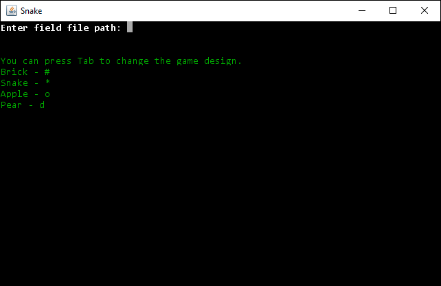
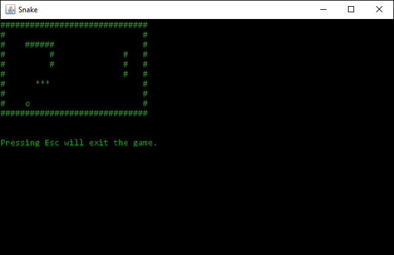
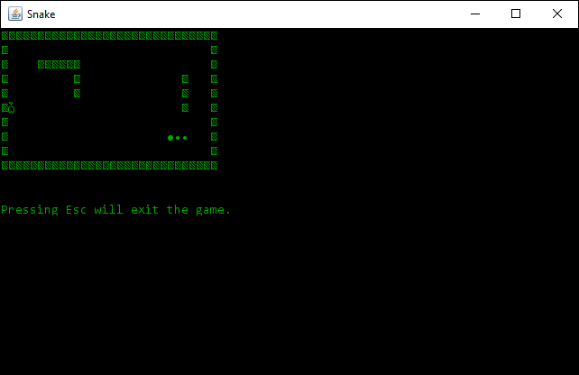
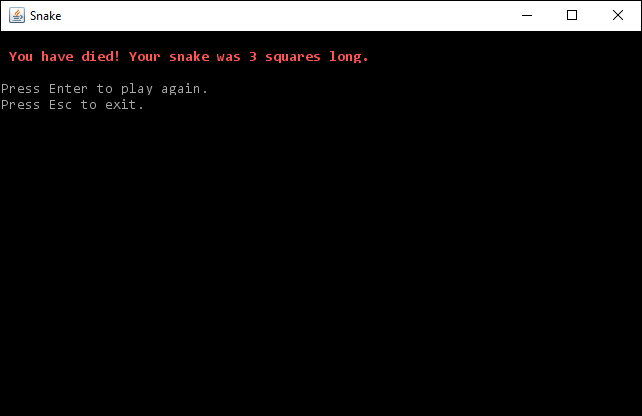

# Text-based Snake game

Classic representation of the Snake game in Java using [Lanterna](https://code.google.com/archive/p/lanterna/) as graphic representation. 

[](LICENSE)

## Prerequisites
* Java 8 or higher.
* Maven

## Installation

Navigate to a new folder of your choice. Clone this repository.
```git
git clone https://github.com/kartaggen/snakeGame.git
```

To build the executable jar file, you need to run the Maven command
```maven
mvn clean compile assembly:single
```

The compiled jar can be found in the newly created folder **target** with the name:
```
snakeGame-1.0-jar-with-dependencies.jar
```

## Screenshots
Screenshot 1 |Screenshot 2
---------------------|-----------------
 | 

Screenshot 3|Screenshot 4
---------------------|-----------------
 | 
